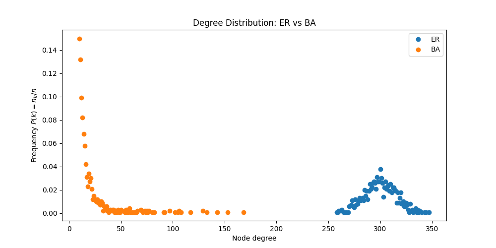

# HW 1 Report

Name: Jianhong Tu

Wustl ID: 498243

## Task 1

### 1.1 Degree Distribution

We observe that the node degrees of the ER model follows the Poisson distribution, with a roughly symmetrical bell-shaped curve centered at 300. However, the degrees of the BA diagram follow the power-law distribution, such that there are high amount of nodes with very small degrees and a few nodes with very high degrees.

